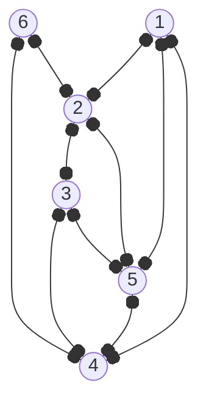

Graf diatas adalah peta tempat pariwisata yang sedang dibangun di ibukota baru. Terdapat 6 tempat wisata yang akan dipromosikan, ditandai dengan nomor dalam lingkaran. dan jalan yang sudah terhubung dengan beberapa tempat wisata lain.

Presiden akan melakukan kunjungan untuk melihat perkembangan pembangunan jalan. Karena jadwal yang sibuk, pemimpin proyek sudah menentukan rute paling efisien perjalanan sehingga semua jalan yang sudah dibangun dilewati minimal satu kali.

Jika pilot harus mendaratkan Presiden di tempat wisata nomor $X$, berapakah nilai $X$ terkecil?
