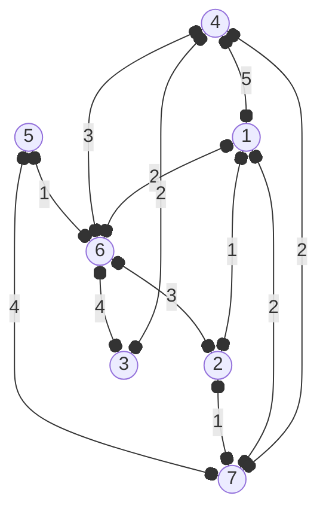

Kwok akan mengunjungi Kwik sahabat lamanya yang sedang bertugas di kota $5$.

Karna tidak ada bandara di kota $5,6$ dan $1$, dimanakah Kwok mendarat supaya jaraknya lebih dekat ke tempat Kwik?

_**Jika lebih dari satu pilihan, tulis bilangan terkecil**_
