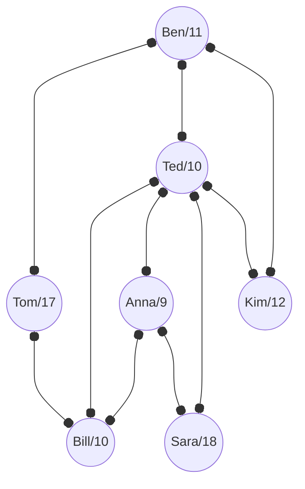

Ada tujuh ($7$) siswa yang gemar membaca buku dan mereka membentuk klub untuk berbagi buku. Jika ada satu buku baru diperoleh (dan dibaca) seorang siswa, kemudian ia akan meneruskan meminjamkan ke anggota klub lainnya dengan cara berikut. Tidak setiap siswa menjadi sahabat siswa lainnya, maka seorang siswa hanya meneruskan meminjamkan buku ke siswa yang bersahabat dengannya. Jika seorang siswa mempunyai beberapa sahabat, maka sahabat yang paling muda yang akan dipinjami terlebih dulu, yang belum pernah meminjam buku itu. Kalau semua sahabatnya sudah pernah meminjamnya, maka ia akan mengembalikan ke siswa yang sebelumnya meminjamkan buku itu kepadanya.

Diagram berikut menunjukkan tujuh siswa dan garis-garis menunjukkan hubungan "sahabat" itu. Setiap simpul berisi informasi nama dan umur.

Ben selesai membaca sebuah buku baru dan ingin berbagi dengan semua anggota klub dan selain Ben belum ada yang pernah membacanya. Siapa yang akan menjadi pembaca terakhir dari buku tersebut?

